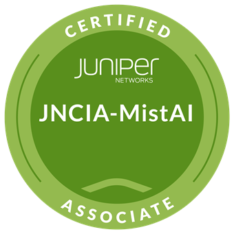
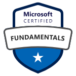

### Juniper Networks Certified Associate, Mist AI (JNCIA-MistAI)

2025 AUG

### Juniper Networks Certified Associate, Junos (JNCIA-Junos)

2025 MAY

[Juniper Networks Certified Associate, Junos (JNCIA-Junos) - Credly](https://www.credly.com/badges/858e4f1f-781c-4a29-9eb2-0675529f72d7)

### Microsoft Certified: Power Platform Developer Associate (PL-400)

2024 SEPT

[Microsoft Learn - Credentials - Microsoft Certified: Power Platform Developer Associate](https://learn.microsoft.com/en-us/users/victorwitkamp-3261/credentials/6fb6277ef8c4af7d)

### Microsoft 365 Certified: Fundamentals (MS-900)

2023 FEB

[Microsoft Learn - Credentials - Microsoft 365 Certified: Fundamentals](https://learn.microsoft.com/en-us/users/victorwitkamp-3261/credentials/abb6a40714512066)

